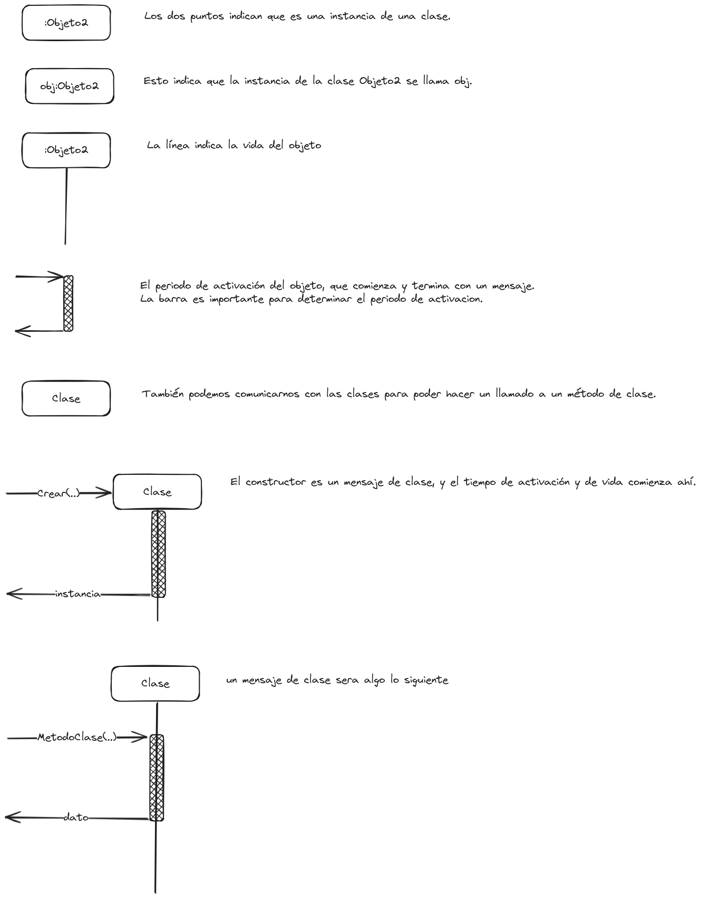
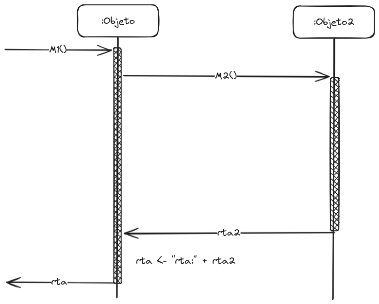
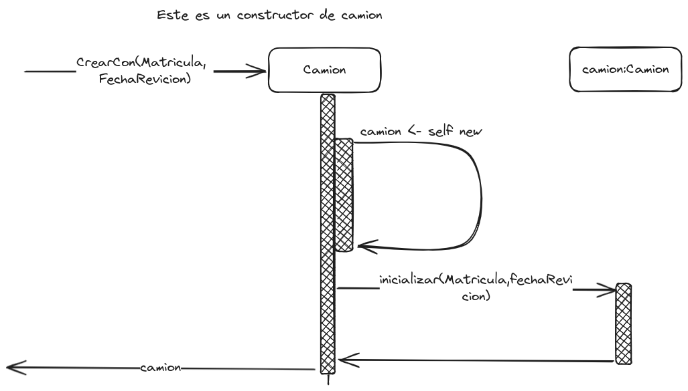
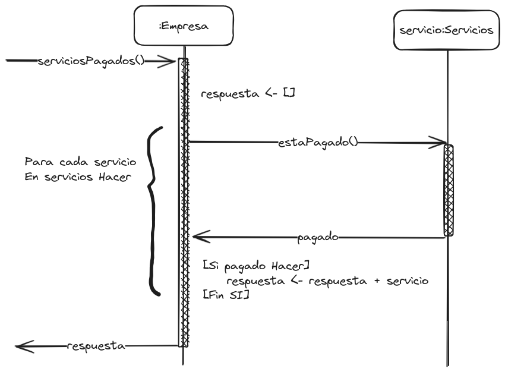
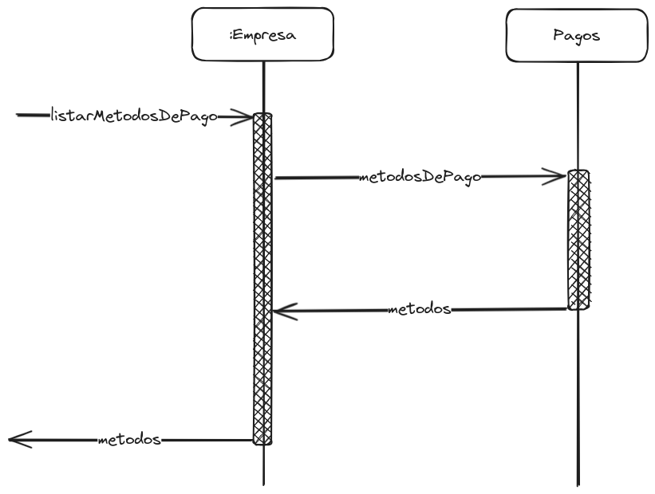

# Diagramas de Secuencia / Modelos Dinámicos

[Inicio](../README.md)

Los diagramas de secuencia son una parte importante del modelado dinámico en UML (Unified Modeling Language). Estos diagramas muestran cómo los objetos interactúan en una secuencia de eventos a lo largo del tiempo.

En un diagrama de secuencia, se representan objetos como cajas rectangulares y se muestran líneas de vida que indican la existencia y duración de cada objeto durante la secuencia de eventos. Las líneas de vida se colocan verticalmente y las interacciones entre objetos se representan mediante flechas que indican los mensajes enviados entre ellos.

Los diagramas de secuencia ayudan a comprender el flujo de control y la comunicación entre objetos en un sistema. Son especialmente útiles para visualizar el comportamiento dinámico de un sistema, mostrando cómo los objetos colaboran entre sí para lograr una tarea específica o para responder a eventos externos.

Además de esto, nos describen cómo se comportan de forma lógica los métodos que tendrán que implementar los objetos. De esta manera, podrás saber qué métodos se tienen que implementar en los diferentes objetos que participan, si tenemos que iterar una colección, o si tenemos que tener en cuenta el estado del objeto al cual se le pide dicho dato.

## Notaciones Básicas

## Ejemplo de Diagrama

## Constructor

## Condiciones y Bucles

## Métodos de Clase

## Recomendaciones

- Evitar tener un diagrama infinito hacia la derecha.
- Evitar tener un diagrama infinito hacia abajo.
- Modularizar y delegar.
