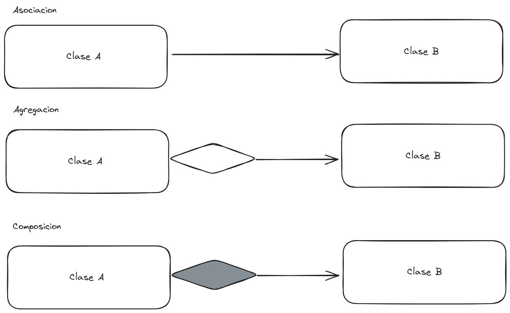
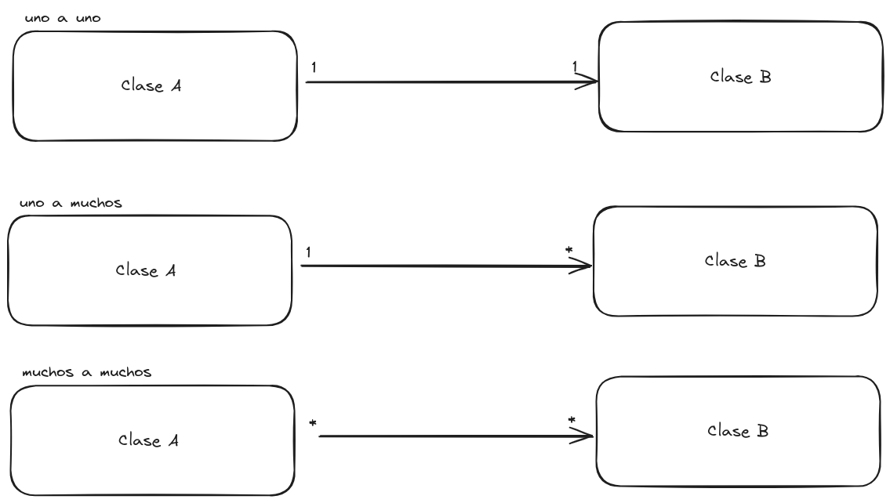

# Modelos

[Inicio](../README.md)

Necesitamos una forma de modelar las interacciones entre objetos que no sea con dibujitos, para esto usaremos UML.

UML (Unified Modeling Language) es un lenguaje estándar de modelado visual utilizado en ingeniería de software para representar sistemas complejos. Proporciona una forma de visualizar la estructura y el comportamiento de un sistema a través de diferentes tipos de diagramas, como diagramas de clases, diagramas de secuencia, diagramas de actividades, entre otros. UML es ampliamente utilizado en el desarrollo de software para comunicar ideas, diseñar sistemas y documentar el proceso de desarrollo.

# Modelo Estático

Este modelo indica los objetos, sus atributos, sus mensajes, el nivel de acceso a los métodos y atributos (públicos, privados), además de sus relaciones y la cardinalidad.

1. **Atributos:** son las características o propiedades que describen el estado de un objeto. Por ejemplo, si consideramos un objeto "Coche", los atributos podrían ser "marca", "modelo", "color", etc. Estos atributos representan datos asociados con el objeto y pueden tener diferentes tipos, como números, cadenas de texto, booleanos, entre otros.
2. **Métodos:** por otro lado, son las acciones o comportamientos que un objeto puede realizar. Estos métodos definen qué puede hacer el objeto y cómo interactúa con otros objetos. Siguiendo el ejemplo del coche, podríamos tener métodos como "arrancar", "detenerse", "acelerar", etc. Los métodos pueden acceder y modificar los atributos del objeto, así como realizar cualquier otra operación necesaria para cumplir su función.
3. **Relaciones:** los objetos se relacionan entre sí y de esta manera se comunican. Existen diferentes tipos de relaciones entre objetos:
   1. **Asociación:** El objeto A conoce al objeto B. La clase A depende de B. Ejemplo: Asociación en UML. El profesor se comunica con los estudiantes.
   2. **Composición:** La clase A se compone de objetos de la Clase B, y los objetos de la clase B no pueden existir sin A.
   3. **Agregación:** La clase A se compone de objetos de la clase B, pero los objetos de la clase B pueden existir sin A.

4. **Cardinalidad:** Define con cuántos objetos participan en la relación.
   - uno-uno: un objeto A puede tener como máximo un objeto B, y un objeto B solo puede estar en una relación con A.
   - uno-muchos: un objeto A puede tener muchos objetos B (una colección), y un objeto B puede estar en una relación con A.
   - muchos-muchos: un objeto A puede tener muchos objetos B (una colección), y un objeto B puede estar en más de una relación con A.

