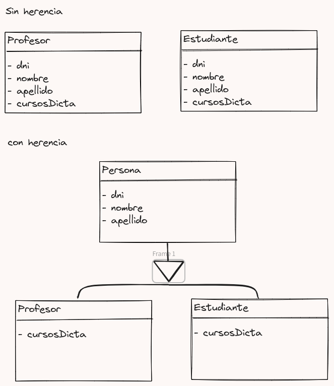

# Herencia y Polimorfismo

[Inicio](../README.md)

## Herencia

la herencia es un mecanismo para la reutilizacion de codigo. Supongamos que tenemos dos clases:

ahora estamos repitiendo el codigo (metodos getNombre y getDni ) y atributos (nombre y dni). la herencia permite crar una clase que tenga un comportamiento comun a otras (atributos y metodos similares) ademas de un mecanimos para poder diseñar o trabar con objetos de diferentes clases como si fueran una.

## Polimorfimos

Objetos de diferentes clases entienden los mismos mensajes o entienden un conjunto de mensajes. Las respuestas a estos mensajes pueden variar y es la idea del uso del polimorfismo. Vamos a trabajar el polimorfismo en la herencia ya que evitamos errores de objetos del conjunto no tengan un mensaje definido.

Ahora el mensaje `getNombre()` es polimorfico y cambia cuando es un Estudiante o un Profesor.

## Tipos de Polimorfismo

### Remplazo

El mensaje heredado es remplazado en las subclases. El ejemplo anterior es una muestra de polimorfismo por remplazo

### Refinamiento

El mensaje heredado es modificado en las sublcases. se suele hacer `super mensajePadre()` para luego aplicar un refinamiento.
podemos modificar el mensaje `getNombre()`.

### Puro

En este caso un el mensaje polirfico es hereado pero se modifica alguna clase auxiliar que use dicho metodo para cambiar el comportamiento del metodo heredado.

En este caso el cambio en el metodo `getNombre()` en las subclases cambiara el comportamiento del toString heredado.

## Ligadura

Es la forma en la que el lenguaje asocia las llamadas a funciones y referencias a variables con las definiciones correspondientes (sus clases).

- **Ligamento Estático:** En el momento de la declaracino de una varible esta solo puede acceder a sus metodos y los heredados de la subclase.
  - Ej: tenemos la super clase A con los metodos (M1, M2) y la subclase B con los metodos (M1, M2, M3) si hacemos lo siguiente `A objeto = new B();` ahora la instancia objeto solo podra acceder a (M1, M2) de A y a (M3) de B. por lo que el remplazo o el refinamiento no tendran efecto.
  - cada lenguajes con ligamento estatico es diferente por lo que existen formas de indicar que el ligamente tiene que ser dinamico.
- **Dinámica:** Ocurre en tiempo de ejecución, por lo que la evaluación de qué tipo de función o método llamar ocurre mientras se ejecuta la aplicación, de forma que se buscaran los metodos en la jerarquia de la clase.

## Notas finales

- cuando se quiere hacer uso de un metodo de la clase padre y no en el heredado (puede tener aplicado algun polimorfimo) hacemos uso de la palabra reservada `super`.
